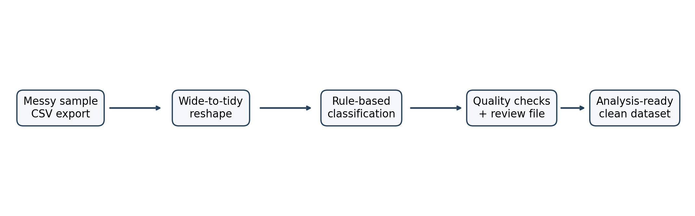
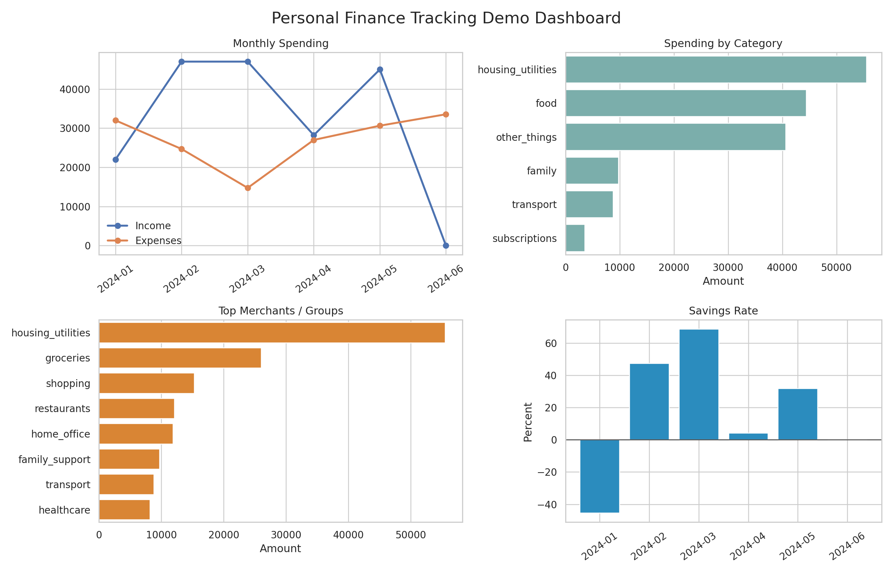
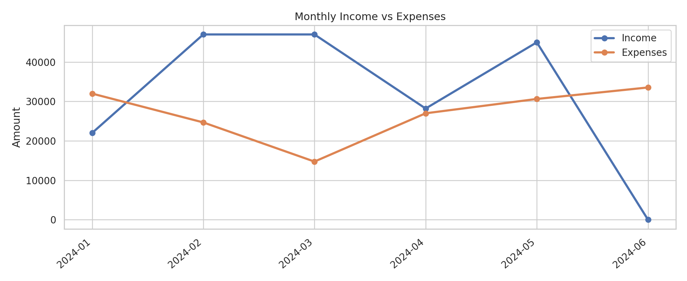
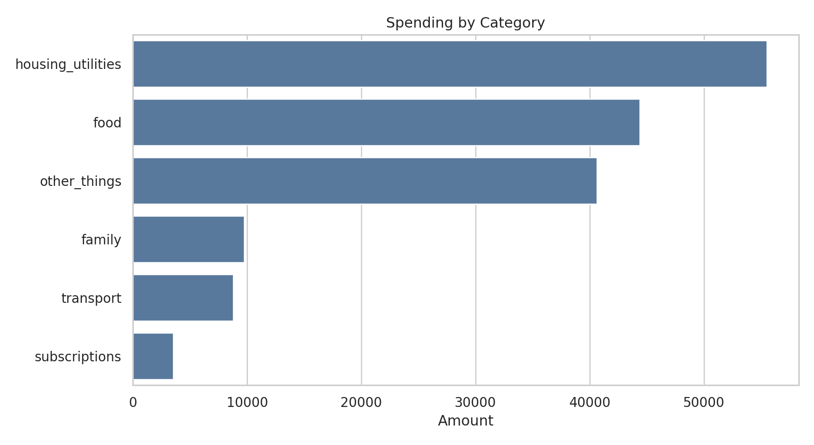

# Personal Finance Tracking

This project cleans a messy household finance export into a dataset you can actually analyze.

The public version of this repository uses fully fictional sample data. It shows the cleaning process, classification rules, quality checks, and dashboard outputs without exposing any real financial history.

## Project Overview

It turns a messy finance export into a clean transaction table you can use in Tableau or any other BI tool.

It demonstrates:
- data cleaning
- data validation
- reproducible ETL-style workflow
- rule-based categorization
- review queues for unresolved values
- privacy-aware publication practices

## Motivation

The original private project solved a real problem: turning a cluttered personal finance workbook into something analyzable.

That private version cannot be published safely. Rather than strip out all the context, this repo shows the cleaning work with sample data instead of real financial history.

## Features

- Wide-to-tidy transaction reshaping
- Forward-filled dates for continuation rows
- Amount normalization for messy numeric strings
- Exact classification rules in `data/reference/classification_rules.csv`
- Keyword fallbacks for unseen variants
- Review queue for unresolved descriptions
- Sample dashboard screenshots generated from the cleaned sample dataset
- Notes on what was removed for privacy

## Cleaning Pipeline

Flow:

`messy sample export -> transaction area -> tidy rows -> classification rules -> quality checks -> clean sample dataset`

Main implementation files:
- `01_clean_personal_finances.ipynb` — walkthrough notebook
- `src/finance_pipeline.py` — reusable cleaning functions
- `scripts/build_sample_assets.py` — rebuilds the public sample data, outputs, and images

Run the pipeline:

```bash
python3 -m venv .venv
source .venv/bin/activate
pip install -r requirements.txt
python scripts/build_sample_assets.py
```

Or open the notebook and run it top to bottom:

- `01_clean_personal_finances.ipynb`

## Folder Structure

```text
.
├── 01_clean_personal_finances.ipynb
├── README.md
├── cleaning_plan.md
├── data/
│   ├── quality/
│   │   ├── cleaning_summary_sample.csv
│   │   └── unmapped_details_sample.csv
│   ├── reference/
│   │   └── classification_rules.csv
│   └── sample/
│       ├── cleaned_transactions_sample.csv
│       └── raw_transactions_sample.csv
├── docs/
│   ├── audit_summary.md
│   ├── classification_rules.md
│   ├── privacy_decisions.md
│   └── quality_checks.md
├── images/
│   ├── dashboard_categories.png
│   ├── dashboard_monthly.png
│   ├── dashboard_overview.png
│   └── workflow.png
├── scripts/
│   └── build_sample_assets.py
├── src/
│   └── finance_pipeline.py
└── tableau/
    └── dashboard_spec.md
```

## Sample Workflow

1. Start with `data/sample/raw_transactions_sample.csv`
2. Run `scripts/build_sample_assets.py` or the notebook
3. Review `data/quality/unmapped_details_sample.csv`
4. Add or refine rules in `data/reference/classification_rules.csv`
5. Rerun the pipeline
6. Use `data/sample/cleaned_transactions_sample.csv` in Tableau

## Technologies Used

- Python
- pandas
- numpy
- openpyxl
- matplotlib
- seaborn
- Jupyter Notebook
- Tableau-ready CSV outputs

## Dashboard Preview

The cleaned sample data is used to create a lightweight portfolio dashboard with these views:
- Monthly Spending / Income vs Expenses
- Spending by Category
- Top Merchant Groups
- Savings Rate

Preview images:









The Tableau worksheet spec is here:
- `tableau/dashboard_spec.md`

## Privacy Notice

The original private dataset is intentionally excluded from this repository.

Not published:
- real transactions
- real merchant names
- real balances
- real income values
- real dates
- personal labels or family references
- any personally identifying financial details

The sample data is fake, but it still includes the same kinds of messiness the real workflow had to handle.

More detail:
- `docs/privacy_decisions.md`
- `docs/audit_summary.md`

## Future Improvements

- Add automated tests for the pipeline module
- Add a packaged Tableau workbook when there is a workable way to generate one
- Expand quality checks for duplicate detection and schema validation
- Add a private/public rule split for teams with mixed sensitive and shareable logic
